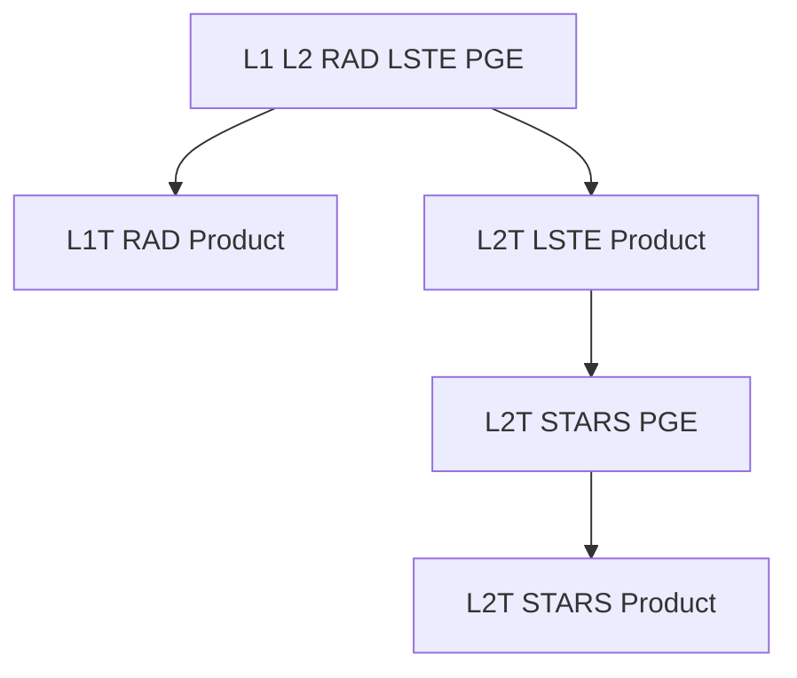

# ECOSTRESS Collection 2 Data Product Algorithms

This will contain the algorithms for the ECOsystem Spaceborne Thermal Radiometer Experiment on Space Station (ECOSTRESS) collection 2 data products. 

Please refer to the [ECOSTRESS tutorials](https://github.com/ECOSTRESS-Tutorials) for information on accessing and utilizing the ECOSTRESS data products.

ECOSTRESS collection 2 is a precursor to the [Surface Biology and Geology Thermal Infrared (SBG-TIR) Orbiting Terrestrial Thermal Emission Radiometer (OTTER) data products](https://github.com/sbg-tir).

This document will provide background information relevant to the ECOSTRESS mission and data products. 

